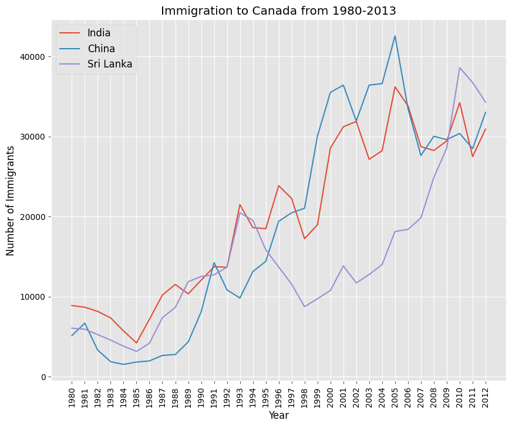

# Immigration Dataset Analysis and Visualization

## Overview
This project analyzes and visualizes an immigration dataset using Python. The dataset contains information about immigration trends, including the number of immigrants by country, year, and other relevant demographics.

## Features
- Data cleaning and preprocessing
- Exploratory data analysis (EDA)
- Data visualization using Matplotlib and Seaborn
- Insights and trends identification

## Technologies Used
- Python
- Pandas
- Matplotlib
- Seaborn
- Google Colab

## Dataset
The dataset used in this project includes immigration data from various countries over multiple years. The dataset was sourced from kaggle.

## Visualizations
The project includes various visualizations such as:
- Line charts showing immigration trends over time
- Bar plots comparing immigration from different countries
- Doughnut chart illustrating top 5 countries immigrated to

## Example Output

## Author
[Oke Queen](https://github.com/okeqz)

